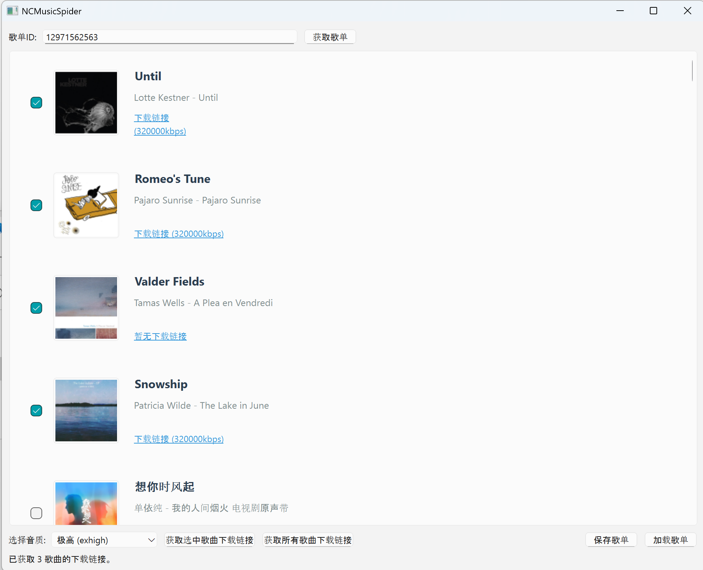

# NCMusicSpider

一个简单的网易云音乐爬虫工具，用于获取歌单信息和下载链接。

## 目前已实现的功能(函数)
- **get_songs**
  - 功能：获取歌曲名字(name)，歌手名(artist)，专辑名(album)，封面(picUrl)
  - 参数：playlist_id(歌单id),limit_num=None(限制数量默认为无，即全部)
  - 返回值：列表songs，其中每个元素都是一个字典，包含了单首歌曲的详细信息
  - 注意：不包含下载链接，因为获取下载链接的接口是单独的！

- **get_dl_urls**
  - 功能：获取歌曲下载链接
  
  - 参数：songs_info(列表，适用于get_songs的返回值)，level(音质等级)
  
  - 返回值：列表songs_with_url(与上面的songs类似，多了码率，下载链接)
  
  - 注意：由于是跨站请求伪造 (CSRF), 伪造请求头 , 调用官方 API，所以需要网易云的cookie，
    理论上可以支持从standard => 标准 到 jymaster => 超清母带 的level。
    *当然，需要你的帐号有相关权限(黑胶vip，svip)*
    
    > hhhhhhc,是不是觉得竟然还要vip那这个破项目有啥用，哈哈哈哈，因为使用官方的下载是加密后的格式的，
    >
    > （虽然但是有网上有不少解密的），而且甚至就算是会员下载数量也有限制，但是通过这个跨站请求伪造 (CSRF), 伪造请求头 , 调用官方 API理论上是可以实现无限制的查询下载链接。

- **save_to_json**
  - 以json格式保存查询到的数据
- **write_links_to_txt**
  - 把获取到的下载链接和音乐文件名（歌曲名-歌手）批量写入txt文件
- **downloader.sh**
  - 一个shell脚本，批量用wget下载，逻辑相当简单：读取links.txt进行下载（Linux下是肯定可以用的，WIn的话应该会有地址和wget的安装问题，实际上改下存放链接的links.txt应该也是可以使用其他第三方下载器如IDM来进行批量下载的）

- **main()**

  - 程序主入口：这个是真的相当简陋了，一些简单的逻辑，伪GUI都没写，hhhhhc手搓代码确实累，懒得搞了

  

> 以上就是本项目的简单逻辑和功能，只做了批量爬歌单的歌曲的，单曲可以直接通过 [qier222/YesPlayMusic](https://github.com/qier222/YesPlayMusic) 使用浏览器自带的开发者工具抓包就可以下载。这个项目也就是练练手写着玩，自己python用的也不多，什么异步，异常处理都没写。如果有人觉得不错想一起搞的话，可以联系我，有人一起的话就重构一下，到时候完善一下功能，说不定还可以做一个前端对接一下。这个项目目前仅仅是自己花费2，3天的零散时间写的，代码写得就像倚托。主要还是方便自己的使用和练练手，代码逻辑相当简陋。如有大佬，不喜勿喷。


### 新增功能 

- **add_music_tags**
  - 使用mutagen库给音乐文件打上信息标签，强迫症福音！写入音乐文件的封面和基本信息，使用本地播放器或者文件浏览器是会舒服很多


### 效果演示





## 环境变量配置

在 `.env` 文件中配置以下信息：

```
PLAYLIST_API="https://example.com/playlist/track/all"
DOWNLOAD_API="https://example.com/song/url/v1"

NETEASE_COOKIE="your_netease_cookie_here(MUSIC_U=……)"

USER_AGENT="Mozilla/5.0 (Windows NT 10.0; Win64; x64) AppleWebKit/537.36"
```

部署网易云 API，详情参见 [Binaryify/NeteaseCloudMusicApi](https://github.com/Binaryify/NeteaseCloudMusicApi)

>  emm，可暂用 https://musicapi.zjgsu-forum.top ,这个是我自己部署到vercel然后挂到自己的子域名上的，这个域名暂时应该还是会用着的，以后说不准，最好是自己搭一个，还可以对接一下 [qier222/YesPlayMusic](https://github.com/qier222/YesPlayMusic) 给自己用。cookie的话网页版网易云登录就可以从浏览器的开发者工具里获取，要的是“MUSIC_U”那个。


## 致谢

感谢[NeteaseCloudMusicApi](https://github.com/Binaryify/NeteaseCloudMusicApi)提供支持
